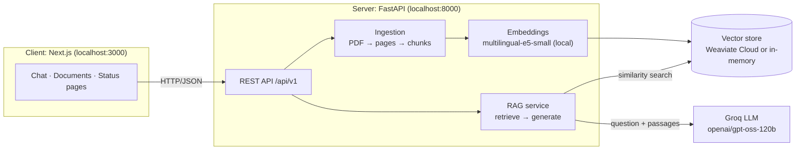

# 📚 Study Buddy

Study Buddy is a **Retrieval-Augmented Generation (RAG)** study assistant. Upload your school
books and notes as PDFs, then ask questions about them in Greek or English. You get answers drawn
from your documents, with **citations to the exact file and page**.

Everything runs locally on your PC and uses **free** services only.

- **Server** (`server/`): a FastAPI REST API. It reads PDFs, indexes them in a vector store, and
  answers questions using an LLM.
- **Client** (`client/`): a friendly Next.js web interface in Greek, written for students. It has
  pages for Chat (Συνομιλία), My books (Τα βιβλία μου) and Status (Κατάσταση), and is hosted by
  **Σοφούλα**, an owl mascot in a graduation cap 🦉 (the owl is Athena's symbol of wisdom).

---

## Contents

1. [How it works](#how-it-works)
2. [Tech stack](#tech-stack)
3. [Project structure](#project-structure)
4. [Prerequisites](#prerequisites)
5. [Setup](#setup)
6. [Running the app](#running-the-app)
7. [Using the app](#using-the-app)
8. [API reference](#api-reference)
9. [Configuration](#configuration)
10. [Testing and code quality](#testing-and-code-quality)
11. [Architecture](#architecture)
12. [Troubleshooting](#troubleshooting)

---

## How it works



**Uploading a document (ingestion)**
1. `pypdf` extracts the text of each page of the PDF.
2. The text is split into overlapping chunks (default 1000 characters with a 150-character
   overlap). A chunk never spans two pages, so every answer can cite a page number.
3. Each chunk is turned into a vector by `intfloat/multilingual-e5-small`. This multilingual
   model runs locally on the CPU and handles Greek well.
4. The chunks and their vectors are stored in the vector store.

**Asking a question (retrieval and generation)**
1. The question is embedded with the same model.
2. The most similar chunks are retrieved (`top_k`, default 5).
3. The question and the numbered passages go to the LLM through **pydantic_ai**. The LLM must
   answer **only from the passages**, in the same language as the question, and list the passages
   it used.
4. The answer comes back as markdown, with citations giving file, page, snippet and relevance score.

---

## Tech stack

| Layer | Technology | Cost |
|---|---|---|
| Server framework | Python 3.12, **FastAPI**, Uvicorn, Pydantic v2 | Free |
| LLM integration | **pydantic_ai** with **Groq**, model `openai/gpt-oss-120b` | Free tier (API key needed) |
| Embeddings | **sentence-transformers**, `intfloat/multilingual-e5-small`, 384 dimensions | Free and local, no key needed |
| Vector store | **Weaviate Cloud Sandbox**, or in-memory for local development | Free (sandboxes expire after 14 days) |
| PDF parsing | pypdf | Free |
| Server tooling | Poetry, pytest, ruff, mypy | Free |
| Client | **Next.js 16** (App Router, Turbopack), React 19, TypeScript, Tailwind CSS 4, react-markdown, KaTeX (math) | Free |
| Client tooling | npm, Vitest, Testing Library, ESLint | Free |

---

## Project structure

```
study-buddy/
├── README.md                    ← you are here
├── study-buddy.code-workspace   ← VS Code multi-root workspace (+ "Full stack" launch)
│
├── server/                      ← FastAPI RAG API (Python 3.12 + Poetry)
│   ├── pyproject.toml / poetry.lock
│   ├── .env.example             ← copy to .env and fill in
│   ├── .vscode/                 ← server debug configs and test settings
│   ├── src/study_buddy/
│   │   ├── main.py              ← app factory (create_app)
│   │   ├── api/                 ← routes, request/response schemas, error → HTTP mapping
│   │   ├── services/            ← ingestion, retrieval, RAG, document management
│   │   ├── domain/              ← models, errors, ports (interfaces)
│   │   ├── infrastructure/      ← PDF loader, splitter, embedder, vector stores, LLM generator
│   │   └── core/                ← settings + dependency wiring (container.py)
│   ├── tests/                   ← unit, API and integration tests
│   └── README.md                ← server details
│
├── client/                      ← Next.js web UI (Node.js 20.9+)
│   ├── package.json
│   ├── .env.local.example       ← optional overrides
│   ├── .vscode/                 ← client debug configs
│   ├── src/
│   │   ├── app/                 ← pages: chat/, documents/, health/
│   │   ├── components/          ← UI components
│   │   ├── hooks/               ← useChat, useDocuments, useHealth
│   │   └── lib/api/             ← typed API client (mirrors the server schemas)
│   ├── tests/                   ← Vitest tests
│   └── README.md                ← client details
│
└── utilities/                   ← reserved for helper scripts (currently empty)
```

---

## Prerequisites

The instructions below are for **Windows 11 with PowerShell**. macOS and Linux work the same way;
only the install commands and paths differ.

| Tool | Version | Install |
|---|---|---|
| **Git** | any | https://git-scm.com |
| **Python** | 3.12.x (pinned) | `winget install --id Python.Python.3.12 -e` |
| **Poetry** | 2.x | see [Setup, step 1](#1-install-the-tools-once) |
| **Node.js** | 20.9+ (24 LTS recommended) | `winget install --id OpenJS.NodeJS.LTS -e` |
| **VS Code** (optional) | latest | With the **Python** and **Python Debugger** extensions |

You also need two free accounts:

| Account | Needed? | Where |
|---|---|---|
| **Groq** API key | **Required.** It powers the LLM. | https://console.groq.com/keys → *Create API Key* |
| **Weaviate Cloud** sandbox | Optional. You can use `VECTOR_STORE=memory` instead. | https://console.weaviate.cloud → *Create cluster* → *Sandbox* |

> **About disk space:** the server's dependencies include PyTorch (a few hundred MB), and the
> embedding model downloads about 470 MB on first start. It's cached in `~\.cache\huggingface`.

---

## Setup

### 1. Install the tools (once)

```powershell
winget install --id Python.Python.3.12 -e
winget install --id OpenJS.NodeJS.LTS -e
```

Next, **turn off the Microsoft Store Python stubs**, or `python` will open the Store instead. Go to
**Settings → Apps → Advanced app settings → App execution aliases** and switch off `python.exe` and
`python3.exe`.

**Close and reopen all terminals and VS Code windows** so they pick up the new PATH. Then:

```powershell
python --version      # Python 3.12.x
node -v               # v20.9 or newer
npm -v

python -m pip install --user pipx
python -m pipx ensurepath
# reopen the terminal, then:
pipx install poetry
poetry --version
```

### 2. Clone the repository

```powershell
git clone https://github.com/dagalakisgeo/study-buddy.git
cd study-buddy
```

### 3. Set up the server

```powershell
cd server
poetry config virtualenvs.in-project true      # creates server\.venv (VS Code finds it automatically)
poetry env use "$env:LOCALAPPDATA\Programs\Python\Python312\python.exe"
poetry install
Copy-Item .env.example .env
```

Edit **`server\.env`**:

```dotenv
GROQ_API_KEY=gsk_...your key...

# Quickest start (no Weaviate account): data is kept in memory until the server restarts
VECTOR_STORE=memory

# Or use your Weaviate Cloud sandbox:
# VECTOR_STORE=weaviate
# WEAVIATE_URL=https://xxxx.weaviate.cloud
# WEAVIATE_API_KEY=...
```

### 4. Set up the client

```powershell
cd ..\client
npm install
```

The client works without any configuration. To point it at a different server, copy
`.env.local.example` to `.env.local` and edit it.

---

## Running the app

The app needs **two processes**: the server on port **8000** and the client on port **3000**.

### Option A: VS Code (one click)

1. **File → Open Workspace from File…** → `study-buddy.code-workspace`
2. Select the server's Python interpreter once: `Ctrl+Shift+P` → **Python: Select Interpreter** →
   **server** → `.venv\Scripts\python.exe`
3. Open **Run and Debug** (`Ctrl+Shift+D`).
4. Pick **Full stack (server + client)** and press **F5**.

Both processes start under the debugger. The browser opens the API docs
(http://127.0.0.1:8000/docs) and the app (http://localhost:3000). Stopping either one stops both.

Other launch configurations:

| Configuration | Purpose |
|---|---|
| **Server: FastAPI (debug)** | Server only, with breakpoints. Opens `/docs`. |
| **Server: pytest (debug)** | Server tests under the debugger |
| **Client: Next.js (debug)** | Client only (`npm run dev`). Opens the app. |
| **Client: Vitest (debug)** | Client tests |

### Option B: two terminals

```powershell
# Terminal 1: server
cd C:\repos\study-buddy\server
poetry run uvicorn study_buddy.main:create_app --factory --reload
```

```powershell
# Terminal 2: client
cd C:\repos\study-buddy\client
npm run dev
```

Then open **http://localhost:3000**.

The first server start downloads the embedding model, which can take a minute. Wait for
`Application startup complete.` before using the app.

---

## Using the app

| Page | What you can do |
|---|---|
| **Τα βιβλία μου** (`/documents`) | Drag and drop a PDF (up to 20 MB), see the page and chunk count, browse your books as a shelf of cards, delete books |
| **Συνομιλία** (`/chat`) | Chat with Σοφούλα. Click a starter question or type your own; Enter sends, Shift+Enter adds a new line. Choose how many sources to use per answer. Expand **Πηγές** to see citations. **Νέα συνομιλία** clears the chat. |
| **Κατάσταση** (`/health`) | Server and vector store status, refreshed every 10 seconds. The owl is awake when everything works and asleep when the server is off. |

The status dot in the navigation bar shows whether the server is reachable.

**Notes:**
- Chat history lives only in the browser tab. The server doesn't store conversations.
- With `VECTOR_STORE=memory`, uploaded documents disappear when the server restarts.
- Scanned PDFs (images without a text layer) can't be read. The server replies "no extractable
  text".

---

## API reference

The base URL is `http://localhost:8000/api/v1`. Interactive docs are at
**http://localhost:8000/docs**.

| Method | Path | Request | Response |
|---|---|---|---|
| `GET` | `/health` | – | `{status: "ok"\|"degraded", checks: {vector_store: bool}}` |
| `POST` | `/documents` | multipart form, field `file` (PDF) | `201 {document_id, filename, pages, chunks}` |
| `GET` | `/documents` | – | `[{document_id, filename, chunks}]` |
| `DELETE` | `/documents/{document_id}` | – | `204`, or `404` if not found |
| `POST` | `/query` | `{question: string (1–2000 chars), top_k?: 1–20}` | `{answer: markdown, citations: [{document_id, filename, page, snippet, score}]}` |

Errors return `{"detail": "..."}` with these status codes:

| Status | Meaning |
|---|---|
| 404 | Document not found |
| 413 | File too large |
| 415 | Not a PDF |
| 422 | Invalid input, or a PDF with no text |
| 502 | LLM error |
| 503 | Vector store unavailable |

---

## Configuration

### Server: `server/.env`

| Variable | Default | Description |
|---|---|---|
| `GROQ_API_KEY` | – | **Required.** Groq API key. |
| `LLM_MODEL` | `openai/gpt-oss-120b` | Any Groq chat model that supports tool calling (e.g. `openai/gpt-oss-20b`) |
| `VECTOR_STORE` | `weaviate` | `weaviate` or `memory` |
| `WEAVIATE_URL` / `WEAVIATE_API_KEY` | – | Required when `VECTOR_STORE=weaviate` |
| `WEAVIATE_COLLECTION` | `DocumentChunk` | Collection name (created automatically) |
| `EMBEDDING_MODEL` | `intfloat/multilingual-e5-small` | Any sentence-transformers model |
| `EMBEDDING_QUERY_PREFIX` / `EMBEDDING_DOCUMENT_PREFIX` | `"query: "` / `"passage: "` | Prefixes required by e5 models. Leave empty for other models. |
| `CHUNK_SIZE` / `CHUNK_OVERLAP` | `1000` / `150` | Chunking, in characters |
| `TOP_K` | `5` | Default number of passages retrieved per question |
| `MIN_RELEVANCE_SCORE` | `0.0` | Drop passages below this cosine similarity |
| `MAX_UPLOAD_MB` | `20` | Upload size limit |
| `CORS_ORIGINS` | `["http://localhost:3000","http://localhost:5173"]` | Browser origins allowed to call the API |

> ⚠️ **If you change `EMBEDDING_MODEL`, re-upload your documents.** Vectors from different models
> aren't compatible. With Weaviate, also use a new `WEAVIATE_COLLECTION` if the vector size
> changes.

### Client: `client/.env.local` (optional)

| Variable | Default |
|---|---|
| `NEXT_PUBLIC_API_BASE_URL` | `http://localhost:8000/api/v1` |
| `NEXT_PUBLIC_MAX_UPLOAD_MB` | `20` (keep it equal to the server's `MAX_UPLOAD_MB`) |

---

## Testing and code quality

**Server:** the tests run offline, using fake embeddings, the in-memory store and pydantic_ai's
`TestModel`. No API keys are needed.

```powershell
cd server
poetry run pytest                  # unit + API tests
poetry run pytest -m integration   # real Weaviate (needs WEAVIATE_URL / WEAVIATE_API_KEY env vars)
poetry run ruff check .
poetry run mypy src
```

**Client:**

```powershell
cd client
npm test              # Vitest
npm run typecheck     # TypeScript
npm run lint          # ESLint
npm run build         # production build
```

In VS Code, both test suites also appear in the **Testing** panel (the beaker icon).

---

## Architecture

The project follows **SOLID** principles. Each external service sits behind a small interface, so
it can be swapped without changing the rest of the code.

- **Server.** The services in `services/` depend only on the interfaces (*ports*) in
  `domain/ports.py`: `DocumentLoader`, `TextSplitter`, `Embedder`, `VectorStore`,
  `AnswerGenerator` and others. The concrete adapters live in `infrastructure/`, and only
  `core/container.py` decides which ones are used.
  - To support a new file type, add a `DocumentLoader`.
  - To use a different LLM, vector database or embedding model, add an adapter and register it in
    `container.py`.
- **Client.** Pages only put hooks and components together. Components never call `fetch`. All
  HTTP calls go through `src/lib/api/client.ts`, whose types mirror
  `server/src/study_buddy/api/schemas.py`.

More detail: [server/README.md](server/README.md) · [client/README.md](client/README.md)

---

## Troubleshooting

| Problem | Solution |
|---|---|
| `python` opens the Microsoft Store | Turn off the App execution aliases for `python.exe` and `python3.exe` (see [Setup](#1-install-the-tools-once)) |
| `npm` / `node` / `poetry` is not recognized | Close **all** terminals and VS Code windows and reopen them after installing |
| `No module named uvicorn` or `No module named pytest` in VS Code | VS Code is using the global Python. Run **Python: Select Interpreter** → **server** → `.venv\Scripts\python.exe`. In `server/.vscode/settings.json`, use `"envManager": "ms-python.python:venv"`. |
| Server fails with `GROQ_API_KEY must be set` | Add your key to `server/.env` |
| Server fails with `WEAVIATE_URL and WEAVIATE_API_KEY must be set` | Fill them in, or set `VECTOR_STORE=memory` |
| `model_not_found` (404) from Groq | The model was retired. List the models your key can use, then set `LLM_MODEL`: `curl.exe https://api.groq.com/openai/v1/models -H "Authorization: Bearer <key>"` |
| Answers ignore the documents or cite the wrong pages | Check that `EMBEDDING_MODEL` is multilingual (the default is), and re-upload your documents after changing it |
| Client shows "Ο διακομιστής δεν είναι διαθέσιμος" | Start the server, or check `NEXT_PUBLIC_API_BASE_URL` |
| CORS error in the browser console | Open the client at `http://localhost:3000`, or add your URL to `CORS_ORIGINS` |
| "Σφάλμα του γλωσσικού μοντέλου" (502) | Groq error or rate limit. Wait and retry, or switch to `LLM_MODEL=openai/gpt-oss-20b`. |
| Uploaded documents vanished | Expected with `VECTOR_STORE=memory` after a restart. Use Weaviate to keep them. |
| Weaviate stopped working after about 2 weeks | Sandboxes expire after 14 days. Create a new one and update `WEAVIATE_URL` and `WEAVIATE_API_KEY`. |
